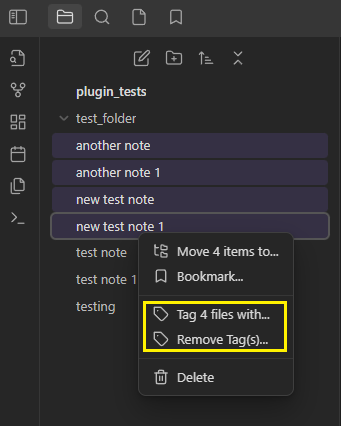
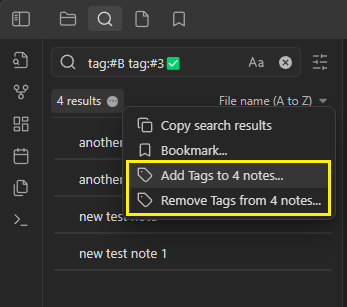
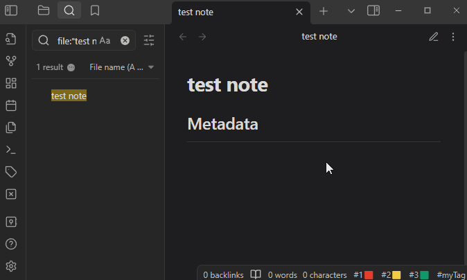

# Obsidian Quick Tagger

This is a plugin for [Obsidian](https://obsidian.md) that adds commands and a GUI to select tags to put in note metadata.

Originally developed to improve my personal workflow, it's very handy in conjunction with [Obsidian Commander](https://github.com/phibr0/obsidian-commander).

## Features
- Command to add tags to Yaml headers.
- Independent add/remove commands to minimize clicking through menus
- Right click on note(s) to add tags
- Tag all search results
- Starred Tags

## Demo

Note that this demo was recorded on mobile with buttons added to the title bar via Obsidian Commander. Some assembly required. Ribbon icons and command pallet actions are available in the standalone plugin, but this is my preferred workflow.

### Menu options

### Starred Tags
Starred tags have the following features, each independently configurable:
  - Add tag to top of the list when selecting a tag
  - Add right-click context entry
  - Add Obsidian command to toggle the tag on the active note (use this to make keyboard shortcuts!)
  - Add status bar button to toggle the command on the active note

## Disclaimer
This plugin is provided as-is, use at your own risk. I've tested it personally and use it on my vault but I can't confirm it's foolproof in every situation.

This plugin does not keep track of changes in an undo/redo queue, please be aware of that while you use it, particularly when bulk tagging or removing all tags.

## Roadmap
- [x] Add a confirmation warning for removing all tags
- [x] Improved settings menu
- [x] Starred tags (improved priority tags)
- [x] Add command for starred tag
- [x] Add button for starred tag in status bar
- [x] Add right-click context menu option for starred tag
- [x] Tweak right-click behavior to toggle tags when tagging a single note
- [x] Permit adding new tag from tag selector
- [x] Toggle recently used tag command
- [ ] Tag chains (cycle through a list of tags)
- [ ] Dialog to add many tags to notes
- [ ] Dialog to Convert tags to linklist items (and vice versa)[^1]

[^1]: For some reason I thought "linklist" was a more official term. Apparently I just picked it up from the example in the [1.4.0 release notes](https://obsidian.md/changelog/2023-07-26-desktop-v1.4.0/) and ran with it.

## Manually install the plugin

Copy `main.js` and `manifest.json` to your vault `VaultFolder/.obsidian/plugins/obsidian-quick-tagger/`.

## Development notes
The [official documentation on tags](https://help.obsidian.md/Editing+and+formatting/Tags#Tag+format) states only alphanumeric, underscores, hyphens, and forward sladshes are supported. I use lots of emojis in tags, which got me thinking and then testing thousands of unicode characters. The ones I found to be bad are included in the [constants file](https://github.com/Gorkycreator/obsidian-quick-tagger/blob/master/src/constants.ts). If you find invalid characters that make it through this filter, please open an issue or create a PR on the constants file.

## Special thanks to...
- [Supercharged links](https://github.com/mdelobelle/obsidian_supercharged_links) and [Obsidian Variables](https://github.com/jffaust/obsidian-variables) for examples of adding and removing setting elements.
- [QuickAdd](https://github.com/chhoumann/quickadd) for examples of how to add and remove commands.
- [Toggl Track](https://github.com/mcndt/obsidian-toggl-integration) and [Spaced Repetition](https://github.com/st3v3nmw/obsidian-spaced-repetition) for examples of working with status bar elements.